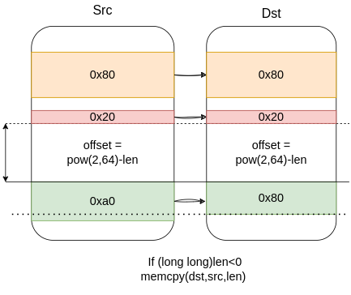

# RetroverFlow

Retro Overflow for `memcpy` when you can control the third parameter of it.

# tl;dr
Assume we have control of the third parameter of `memcpy(dst,src,len)`. Then

We can perform at most 0xa0 bytes arbitrary write at any address lower than `dst`.

Here is a picture that shows how `memcpy` works if we provide a negative length.

# [Stack-Poc][4]

In the stack demo, the `dst` is in the main function's stack frame which is higher than the current stack frame so we can overite the return address of the current function.

If this case is too ideal, we can leak libc/heap and then attack libc/heap to exploit.

# [Heap-Poc][3]

The example shows how we attacked the tcache management struct. We can also attack other chunks. For example, the freed chunk and overwrite its fd to link a fake chunk into the `tcache`.

# Acknowledge
- This bug is found by [@Swing][1] [@leommxj][5] @n132.
- The root cause of this bug is in this [file][2]

[1]: https://github.com/WinMin
[2]: https://codebrowser.dev/glibc/glibc/sysdeps/x86_64/multiarch/memmove-vec-unaligned-erms.S.html#541
[3]: ./Heap
[4]: ./Stack
[5]: https://github.com/leommxj
